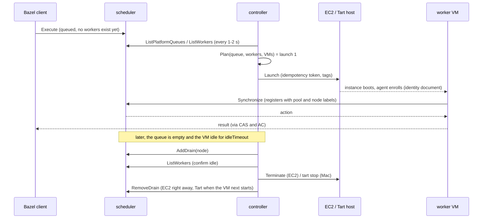

<!-- SPDX-License-Identifier: FSL-1.1-ALv2 -->
# Cucina architecture

Cucina is a managed distribution of [Buildbarn](https://github.com/buildbarn): Bazel remote execution and remote caching (REAPI v2),
installed with one Helm chart. "Managed" means the operator declares worker pools, Mac hosts and trust, and Cucina generates all
Buildbarn configuration and runs the fleet lifecycle: provisioning, scale to and from zero, draining, image rollout, health and
replacement, cache topology, authentication and observability. Cucina composes **unmodified upstream Buildbarn components**; its
own code is the glue: a controller, a macOS host agent, a worker agent, a CLI, images and the chart.

This document explains how the parts fit and why. [`contracts.md`](contracts.md) is the precise reference for the interfaces between
them, [`security.md`](security.md) for identities and tokens, and the [runbooks](operations/README.md) for operating the result.

## 1. The picture

```text
 Bazel clients ──TLS + JWT──► frontend (bb_storage) ──────► storage shards (bb_storage `local`, persistent PVCs)  = L3
                                │ Execute
                                ▼
                              scheduler (bb_scheduler, predeclared queues) ◄── BuildQueueState ── cucina-controller ──► EC2 API
                                ▲ worker API (mTLS)                                                    ▲ outbound gRPC (mTLS)
         ┌──────────────────────┴──────────────────────┐                                              │
 EC2 Linux x86_64/arm64 + Windows workers (bb_worker +    Mac host: cucina-hostd ── tart ──► ≤ 2 macOS VMs (bb_worker + bb_runner, L1;
 bb_runner; qemu runners; L1 on NVMe / ephemeral EBS)              │                          Xcode + generic arm64 runners)
                                                                   └─ L2 bb_storage cache on host SSD
```

Everything above the workers runs in Kubernetes and is always on. Workers are virtual machines, started on demand from the
scheduler's queue and stopped when idle.

| Pool type | Runs on | Idle state |
| --- | --- | --- |
| EC2 Linux x86_64 and arm64 (Graviton) | EC2 instances in the operator's VPC | No instances exist: terminated, with every volume and IP released |
| EC2 Windows (x86_64) | EC2 instances | No instances exist |
| macOS (arm64) | Tart VMs on always-on Apple-silicon Mac minis | VMs shut down (disk kept); hosts stay on |

## 2. Components

| Component | What it is | Runs where |
| --- | --- | --- |
| **frontend** | `bb_storage`, stateless. Client listener (TLS and JWT) and worker listener (mTLS). Shards CAS and AC across storage, routes Execute to the scheduler, advertises zstd, puts existence caching in front of `FindMissingBlobs` and completeness checking around the AC | Deployment: two or more replicas in the `medium` and `large` size profiles, one in `small` |
| **storage** | `bb_storage` with the persistent `local` backend, N shards, one PVC each, holding CAS, AC and the other small stores. The central cache (L3) | StatefulSet |
| **scheduler** | `bb_scheduler` with predeclared platform queues. In-memory state, one replica, `Recreate` | Deployment |
| **cucina-controller** | One Go binary: the `WorkerPool` and `MacHost` reconcilers and the autoscaler, plus the servers listed below. Leader elected; two replicas in the `medium` and `large` profiles, one in `small` | Deployment |
| **STS** | The controller binary in `sts` mode: a stateless token-exchange service, its own two-replica Deployment | Deployment |
| **worker agent** (`cucina-worker-agent`) | At every boot: enrolls the instance, writes `bb_worker` and `bb_runner` configuration, prepares the L1 volume. Afterwards a supervisor that enforces the dead-man switch | On every EC2 worker and macOS VM |
| **host agent** (`cucina-hostd`) | Dials out to the controller, runs `tart` as a dedicated user, runs the host L2 cache, injects configuration and short-lived identities into VMs | Each Mac mini (root LaunchDaemon) |
| **`cucinactl`** | The CLI and TUI, and the Bazel credential helper. There is no web UI | Developer machines and CI |
| **Worker images** | Packer-built AMIs (Linux x86_64 and arm64, Windows) and a Tart image (macOS), each carrying a version label that maps to a pool generation | Built per operator |

The controller binary serves, besides the reconcilers: the **STS**, the **enrollment** service (EC2 identity documents, Mac host tokens), the
**host stream** (`HostService`), the **management API** used by `cucinactl`, and Prometheus HTTP service discovery for EC2 workers.

CRDs: `WorkerPool` (one pool: a platform, a provider, capacity, timers, image, provider settings), `MacHost` (one Mac mini, by serial number), and `TrustPolicy`
(who may do what). Pools and trust policies can be declared in Helm values (the chart renders the objects) or created directly.

## 3. Platforms, runners, queues

A **platform** is a pool's identity: OS, ISA and toolchain image. The catalog is [`platforms/pools.json`](../platforms/pools.json). Platform properties use the
REAPI lexicon (`OSFamily` of `linux`, `windows` or `macos`; `ISA` of `x86-64`, `arm-a64`, `arm-a32`, `rv64g`), with documented Cucina extensions (`s390x`,
`cucina-emulation: qemu`, `xcode-version`).

A worker advertises one or more **runners**, each with an exact property set: a Linux x86_64 worker has a native runner and qemu runners for riscv64, s390x and
armv7; a macOS VM has an Xcode runner (with `xcode-version`) and a generic arm64 runner; a Windows worker has one native runner. Buildbarn matches an action's whole
property set exactly against a runner's, so each runner is its own **queue** (instance-name prefix, properties, size class). Pools that differ only in machine size are
size classes of one platform.

The chart renders `predeclaredPlatformQueues` for every queue of every platform used by a pool, so an Execute call queues even when no worker exists (without it
Buildbarn answers `FAILED_PRECONDITION: No workers exist`, which Bazel treats as fatal). Changes that do not alter the queue set apply live; adding a platform restarts
the scheduler ([ADR 0002](adr/0002-queue-declaration-from-values.md)). A pool that can obtain no capacity at all (max 0, missing image, persistent failures)
fails its queued work quickly with a clear message instead of letting clients hang.

Worker IDs carry the labels `pool` and `node` (the EC2 instance ID, or `<host>/<vm>`); Buildbarn adds `thread`. The scheduler counts one worker per runner thread, so the
controller groups threads by `node` to count VMs.

**Instance names** are the unit of authorisation and AC isolation: AC entries are separate per instance name while CAS content is shared and deduplicated (default name: `main`).

## 4. Data flows

### 4.1 Client to frontend to storage (cache)

A Bazel client talks gRPC to the frontend's client endpoint over TLS, presenting a Cucina JWT through the credential helper. Reads and writes go to the frontend, which shards by
digest to the storage pods. Three mechanisms keep this cheap: **existence caching** (a short TTL, never longer than storage retention) in front of `FindMissingBlobs`;
**completeness checking** around the AC, so an AC entry is only returned if everything it refers to still exists; and **zstd** on the client link. Clients that only read set
`--remote_upload_local_results=false`. The cache is **one logical cache**: every client and pool reads and writes the same CAS and AC, so identical content is stored once across
platforms and clients.

### 4.2 Execution

Execute goes from the client to the frontend and on to the scheduler, which places the action on the queue matching its instance name and platform. Workers long-poll the scheduler
(`Synchronize`, over the private worker endpoint with mTLS), receive the action, build an input root in a virtual build directory (only the bytes the action reads are fetched), run it
through `bb_runner`, and upload the outputs to the central CAS. The scheduler also holds the BuildQueueState API that the controller uses; it is reachable only in-cluster, with mTLS and only
for the controller's identity. Because the scheduler keeps state in memory, a scheduler restart loses the queue; builds survive it through Bazel's retries.

### 4.3 The controller loop (scale from zero and back)



* The signal is the scheduler's BuildQueueState API polled every one to two seconds. Prometheus is not in the scaling path.
* Desired VMs per pool are `clamp(max(ceil(sum over runners of demand / vCPUs per VM), max over runners of ceil(demand / slots per VM)), minRunning, max)`, where demand is queued plus
  executing operations. The controller reacts to the first queued action and counts booting VMs as pending capacity, so a burst does not over-provision. A VM that does not register within `startupTimeout` is failed and replaced.
* **Scale-in happens only through per-VM idle timers**, so the pool does not flap. A VM that has been idle for `idleTimeout` with an empty queue is drained, confirmed idle, then terminated (EC2) or
  gracefully stopped with its disk kept (Tart). A busy VM is never stopped unless `drainTimeout` expires; the scheduler or Bazel retries whatever was cut off.
* **Capacity errors** (insufficient capacity, quota, missing image) cause jittered backoff and a walk through the pool's ordered instance types and subnets. If a pool with queued work still has no
  capacity after a configurable window, its queue is failed with a message and an alert fires.
* The decision is a **pure function** (`internal/scaling`): it never does I/O and never reads the wall clock, which is why it can be property-tested and simulated.

### 4.4 The Mac host link

`cucina-hostd` runs as a root LaunchDaemon, starts at boot without a login, and dials **out** to the controller, so it works behind NAT. One bidirectional gRPC stream (`HostService.Connect`) carries the host's
facts and heartbeats up and the controller's commands down: start or stop a VM, drain, re-image, pre-pull an image, collect diagnostics. Hostd runs `tart` as the dedicated non-root `cucina` user (VMs fail
when launched as root), runs the host-level L2 cache, and relays the VMs' traffic: a VM talks only to its host, which gives it L2 for CAS and AC and a TCP relay to the scheduler's worker port. After a VM is up,
hostd generates the VM's key, obtains a short-lived certificate for it, and pushes configuration and certificates in through the Tart guest agent; the VM's worker then registers as `{pool, <host>/<vm>}`. At most
two macOS VMs run per host (Apple's limit). An offline host is marked unavailable and its in-flight actions are retried elsewhere. VMs are persistent: they shut down when idle but keep their disk, and therefore their L1 cache.

### 4.5 Boot and enrollment

* **EC2 worker.** The controller launches the instance with tags that include the pool and generation. At boot the worker agent reads them through IMDS, sends a CSR and the AWS-signed instance identity document to the
  controller's enrollment service, which verifies the signature, cross-checks the instance and its tags against its own launch records, and issues a short-lived certificate plus the worker's settings. The agent renders the
  Buildbarn configuration and starts `bb_runner` and `bb_worker`. Nothing secret is baked into the AMI.
* **Mac host.** MDM pushes the same profile and package to every Mac, including a **site enrollment token** (multi-use, expiring, revocable, bound to a site). A host exchanges it once, with its serial number and a CSR, and
  receives its own identity; the controller admits only serial numbers that were pre-registered or approved by an admin. Revoking the token does not affect hosts that are already enrolled.

## 5. Cache tiers and the cost of moving bytes

| Tier | Where | Lifetime |
| --- | --- | --- |
| **L1** | On the worker. A `readCaching` blob store with the worker's own `local` store in front of the next tier | EC2: the instance's lifetime (zero idle cost forbids keeping volumes); macOS: persistent on the VM disk, survives shutdown |
| **L2** | Near the workers. Mac hosts: a `bb_storage` cache on the host SSD in front of the central storage. EC2: the central storage itself, which sits in the same AZ | Persistent |
| **L3** | Central: sharded `bb_storage` with persistent `local` storage | Persistent, but **not backed up**: it is reconstructible ([storage loss](operations/storage-loss.md)) |

Buildbarn removed its object-storage backends years ago, so L3 is Buildbarn's own block-device ring: new data overwrites the oldest blocks. **Retention** (how old the oldest block is) is therefore the
capacity metric, and it must exceed the longest build and Bazel's remote-cache TTL.

The principles that decide where a byte lives and how it travels (the figures are in [`operations/data-transfer.md`](operations/data-transfer.md)):

1. Never move a byte twice: content addressing, deduplication at every tier, read-through caches that merge concurrent fetches.
2. Move only the bytes that are read: Bazel's "build without the bytes" and remote repository contents cache on clients; virtual build directories on workers.
3. Keep bulk traffic free: one AZ, private addresses, no NAT gateway, no public-IP hairpins, no cross-zone load balancing.
4. Compress only where bytes cost money or bandwidth is scarce (client to cluster, the Mac WAN link), never inside the AZ.
5. Measure every path in bytes and dollars.

| Path | Mechanism in short |
| --- | --- |
| Client to cluster | Dedupe per command, zstd, toolchains held by the repository contents cache instead of being uploaded per client |
| Cluster to client | Only outputs the user needs (`minimal` on CI), zstd, a local disk cache |
| Frontend to storage | In-cluster, uncompressed, existence caching |
| Storage to EC2 workers, and back | Same AZ, private IPs, uncompressed, virtual build directories; free |
| Central to Mac sites | Per-host L2 with a deduplicating replicator, zstd on the WAN hop; each blob crosses once per site |
| Worker images | AMIs stay regional; Tart images are pulled once per site and only changed chunks download |
| Worker management traffic | Dual-stack VPC with an egress-only gateway and an S3 gateway endpoint; no NAT |
| Metrics and logs | In-VPC scraping; hostd relays Mac metrics |

## 6. Identity model

```text
 human / CI ──OIDC──► IdP ──ID token──► Cucina STS ──15-min JWT──► Bazel (credential helper) ──► Buildbarn (validates locally)
 EC2 worker ── AWS-signed identity document ──► enrollment ── short-lived mTLS certificate ──► scheduler, frontend worker listener
 Mac host   ── site token + serial + CSR (once) ──► enrollment ── host certificate (renewed over mTLS) ──► controller
 VM on a host ── key made by hostd ──► hostd obtains a short-lived certificate ──► (only its host can ask)
```

* **Clients.** An external identity (a Google Workspace account via the Desktop-app loopback flow with PKCE, a GitHub Actions job, any OIDC provider) is exchanged at the STS (RFC 8693) for a Cucina JWT
  with a TTL of 15 minutes. A `TrustPolicy` decides, with CEL rules over the external token's claims, whether the token is accepted and what it may do: verbs (`cas-read`, `cas-write`, `ac-read`, `ac-write`,
  `execute`, `admin`) per instance name. The JWT carries those grants as explicit lists. Buildbarn validates the JWT **locally** against a JWKS file, so there is no per-request call to the STS and builds keep running while
  the controller restarts. Authorizers evaluate the grants per operation.
* **Workers and hosts** use mTLS with certificates from Cucina's private CA, short-lived (at most seven days), renewed at every boot (workers) or before expiry (hosts). Identities are SPIFFE-style URI SANs ([`security.md`](security.md)).
* **Revocation.** Normal: the 15-minute TTL plus the STS refusing renewal. Urgent: a deny-list file read by every authorizer (authorizers are not cached), effective in about three minutes. Compromised signing key: remove it from the JWKS
  **and** restart the frontends, because Buildbarn caches validated tokens ([runbook](operations/revocation.md)).
* **Management.** `cucinactl` talks to the controller's management API with the same JWTs and needs the `admin` verb for anything that changes state; every mutating call is written to an audit log. The break-glass admin key that
  `helm install` generates exists to bootstrap the first OIDC admin.
* No long-lived secret is baked into an AMI, a VM image or the macOS package; credentials are delivered at runtime and are rotatable and revocable.

## 7. Failure model

Cucina is designed to be **crash-only**: components hold little state, recover by restarting, and rebuild state from the source of truth (EC2 filtered by tags, the hosts' reports, the scheduler's worker list). Recovery is by restart,
not by special cases.

| What fails | What happens |
| --- | --- |
| A worker dies mid-action | The scheduler requeues the operation, or Bazel retries; the build slows down, it does not fail |
| The scheduler pod restarts | The in-memory queue is lost; clients retry; workers re-register |
| A storage pod restarts | The persistent `local` state survives: the cache is not lost |
| Storage is lost entirely | A cold cache, nothing else; builds slow down until it refills ([runbook](operations/storage-loss.md)) |
| A frontend, the STS or a controller replica restarts | Another replica serves; Buildbarn keeps validating JWTs locally. The `small` profile (the quickstart) runs one frontend and one controller, so there a restart is a short gap that Bazel retries across |
| The controller restarts during a scale-out | It rebuilds from EC2, the hosts and the scheduler; it never double-launches (idempotency tokens derived from the cluster and the pool, an epoch and a sequence number, [ADR 0501](adr/0501-launch-ledger-idempotency.md)) and never terminates a busy worker |
| The controller is gone for good | Every worker powers itself off if it is idle beyond a hard limit, cannot reach the scheduler for ten minutes, or exceeds a maximum uptime; on EC2 power-off means termination |
| A Mac host reboots or loses power | It returns to service unattended (LaunchDaemon, auto-restart), reconnects, and its VMs resume; in-flight actions are retried elsewhere |
| Insufficient capacity or API throttling | Jittered backoff, alternative instance types and subnets, token buckets; after a window the queue is failed with a clear message and an alert fires |

**Invariants stay on in production** and are the same predicates the simulation checks: instances never exceed `max`, at most two macOS VMs per host, never terminate a busy or leased worker, every launched resource is
tagged, no duplicate launch for one idempotency token. A violation aborts the operation, increments `cucina_invariant_violations_total{invariant}`, logs, alerts, and crashes the component if its state is suspect.

## 8. The scale-to-zero cost model

With every EC2 pool at zero, **no worker instance exists**: no stopped instances (they still bill for EBS), no per-worker volumes, Elastic IPs, network interfaces or snapshots. The standing costs are exactly these:

| Standing cost | Applies to | Notes |
| --- | --- | --- |
| The control plane (Kubernetes, storage volumes) | Always | Sized for low idle cost; the storage volume is the main item |
| AMI storage: the current image plus one previous for rollback | EC2 pools | Snapshot storage |
| EC2 Fast Launch's pre-provisioned snapshots | Windows pools only | Approved standing cost; enabled on every new Windows AMI and disabled before an AMI is deregistered |
| Mac minis | macOS pools | Owned hardware; hosts stay on |

Costs that appear only while work runs: instance-seconds (a 60-second minimum per launch), EBS volumes while an instance exists, and data transfer. Anything else that would shorten cold starts is **off by default** and an explicit
opt-in: Fast Snapshot Restore, warm pools, stopped pools, `minRunning > 0`. The controller prices recorded instance time per pool and type and exposes it through `cucinactl cost`, and the cost-leak alerts
(instances running with an empty queue, orphaned volumes or network interfaces) watch the invariant that makes the model true ([runbook](operations/cost-leak.md)).

## 9. Cross-platform builds

A user on any client can build every supported target and run its tests on a worker of the target OS and architecture. Cucina generates the Bazel routing (`@cucina_platforms`) from one matrix: compile execution platforms (one per pool
runner) and a test execution platform per target whose parents are the toolchain's target platforms, so Bazel's default test toolchain lands each test on the right runner. `cucinactl bazelrc --cross --target <platform>` prints the flags.
Compile and link actions run on Linux workers, except that macOS targets compile on macOS workers, with the Apple SDK resolved on the executing machine so that no client ever downloads it. Windows tests from a Linux or macOS client need the
`@bazel_tools` overlay or a patched Bazel ([ADR 0023](adr/0023-windows-tests-from-non-windows-clients.md)). Targets with no runnable OS (WebAssembly, BPF) build and report their test step as not applicable.

## 10. Versions and the Buildbarn schema skew

Cucina pins one matched set of Buildbarn date-tags and renders configuration that matches that exact schema, because Buildbarn parses its configuration as strict protojson and an unknown field aborts startup. At the moment the newest `bb-remote-execution`
release is built against an older `bb-storage` than the newest `bb-storage` release, and the two disagree on the `local` blob-store schema, so the worker's L1 block is rendered in the old flat schema and every `bb_storage` block in the new nested one
([ADR 0001](adr/0001-buildbarn-dual-schema-pins.md)). Every version bump goes through the render check that boots each pinned release binary against every rendered configuration profile ([runbook](operations/buildbarn-upgrade.md)).

| Component | Pin |
| --- | --- |
| Buildbarn `bb_scheduler`, `bb_worker`, `bb_runner` (bb-remote-execution) | `20260930T173749Z-1a3be95` |
| Buildbarn `bb_storage` (bb-storage) | `20260930T153215Z-086b011` |
| Bazel | 9.2.0 (`.bazelversion`) |
| Go, Rust | 1.27.1, 1.98.1 |

Support for new OS, Xcode and Visual Studio releases is routine: a new image version is built and smoke-tested with one command, then a pool generation bump rolls it out
([runbook](operations/new-xcode-vs-os-release.md)). Several versions (for example two Xcode versions) run side by side as separate pools.

## 11. Observability

* **Metrics**: Buildbarn's native metrics; the controller (desired versus actual per pool, VMs by state, start-latency histograms, stop reasons, capacity errors, instance-seconds, estimated cost, invariant violations); hostd (VM states, L2 hit ratio, WAN bytes).
  EC2 workers are scraped through Prometheus HTTP service discovery served by the controller; Mac VMs go through hostd. The metric names are an API ([`contracts.md`](contracts.md) section 6).
* **Alerts** exist for every operational condition in the runbooks: queue time, workers failing to start or register, storage nearly full or retention too short, cache hit-rate drop, host offline, instances running with an empty queue, orphaned volumes or
  network interfaces, certificate expiry, egress anomalies. SLO burn-rate rules are generated from the definitions in `slo/` and unit-tested.
* **Logs**: structured JSON from the controller and hostd; worker logs through SSM (EC2) and `cucinactl workers logs`.
* **There is no web UI.** `cucinactl` and its TUI show live pools, workers, hosts, queues and operations, action details, drains, keys and costs. Grafana dashboards are an optional extra.

## 12. Security boundaries

* **Pools are the trust boundary.** Actions run as an unprivileged user where the OS allows (Linux `runCommandsAs`; the VM user session on macOS). Windows has no upstream privilege separation: the worker runs under a low-privilege account where feasible and the
  residual risk is documented. Use one pool per trust level.
* **Network segmentation.** There is one client endpoint (TLS, JWT) and one private worker endpoint (mTLS) reachable only from the VPC and the Mac sites. The BuildQueueState API is reachable only in-cluster, by the controller's identity. Every endpoint reachable
  from outside the cluster uses TLS; unauthenticated requests are rejected.
* **Public repository.** The repository is public; secrets, state and environment identifiers never enter it ([`TESTING.md`](../TESTING.md) section 6.3).

## 13. Decisions

The fourteen baseline decisions D1 to D14 are recorded as ADRs. Implementation decisions and deviations are recorded by the component that makes them; the [index](adr/README.md#index) lists every ADR.

| # | Decision | ADRs |
| --- | --- | --- |
| D1 | Workers are VMs running `bb_worker` and `bb_runner` natively, not pods | [0011](adr/0011-workers-are-vms.md) |
| D2 | One Go controller with `WorkerPool` and `MacHost` CRDs drives pools from the scheduler's queue state | [0012](adr/0012-custom-controller-queue-driven.md); the decision function: [0500](adr/0500-autoscaler-core-observation-decision-loop.md), [0501](adr/0501-launch-ledger-idempotency.md) |
| D3 | EC2 pools launch on demand and terminate on scale-in; no stopped instances, warm pools or hibernation | [0013](adr/0013-ec2-launch-on-demand-no-stop.md); the provider: [0520](adr/0520-ec2-launch-runinstances-single-client-token.md), [0521](adr/0521-ec2-api-throttling-hygiene.md) |
| D4 | macOS: a custom host agent that shells out to Tart; Orchard is not used | [0014](adr/0014-macos-custom-hostd-tart.md); [0350](adr/0350-macos-worker-image.md), [0700](adr/0700-hostd-vm-network-relay.md), [0701](adr/0701-hostd-privilege-drop.md) |
| D5 | Upstream Buildbarn, unmodified, one pinned matched set, configuration rendered by the chart; no web UI | [0015](adr/0015-upstream-buildbarn-unmodified.md), [0001](adr/0001-buildbarn-dual-schema-pins.md), [0002](adr/0002-queue-declaration-from-values.md) |
| D6 | Cache tiers L1, L2, L3 on local storage; no object-storage backend | [0016](adr/0016-cache-tiers-no-object-storage.md); [0411](adr/0411-l1-placement-and-block-sizing.md), [0413](adr/0413-host-l2-rendering-and-trust.md) |
| D7 | Virtual build directories: FUSE, WinFSP, NFSv4 or native | [0017](adr/0017-virtual-build-directories.md); macOS: [0351](adr/0351-macos-build-directory.md) |
| D8 | Platform identity is the REAPI lexicon plus `xcode-version`; machine sizes are size classes | [0018](adr/0018-platform-identity-size-classes.md), [0353](adr/0353-macos-runner-concurrency.md) |
| D9 | OIDC to STS to a 15-minute JWT for clients; short-lived mTLS for workers and hosts | [0019](adr/0019-auth-oidc-sts-jwt-mtls.md); [0600](adr/0600-deny-list-exact-substring-encoding.md), [0650](adr/0650-ec2-identity-rsa2048-ledger-and-lease-replay.md), [0651](adr/0651-mac-host-enrollment-semantics.md), [0652](adr/0652-workload-identity-naming-and-revocation.md), [0653](adr/0653-single-private-ca-and-two-root-rotation.md) |
| D10 | A Bazel monorepo with Go and Rust and one protobuf API | [0020](adr/0020-bazel-monorepo-go-rust.md), [0100](adr/0100-bazel-monorepo-foundation.md); the Rust RPC stack: [0003](adr/0003-rust-rpc-stack-connect-rust-buffa.md), [0106](adr/0106-rust-codegen-buffa-connect.md) |
| D11 | Cross-platform routing is generated Bazel platforms plus exact runner properties | [0021](adr/0021-cross-platform-routing-generated-platforms.md), [0102](adr/0102-macos-sdk-acquisition.md) |
| D12 | riscv64, s390x and armv7 tests run under qemu-user on Linux x86_64 workers | [0022](adr/0022-qemu-user-for-foreign-architectures.md), [0305](adr/0305-qemu-cross-runtimes.md) |
| D13 | Windows tests from Linux and macOS clients via a `@bazel_tools` overlay, else a patched Bazel | [0023](adr/0023-windows-tests-from-non-windows-clients.md) |
| D14 | Testing policy: tiers, admission, fakes behind owned ports, simulation, production guards, manual checklists | [0024](adr/0024-testing-policy.md), [0025](adr/0025-test-change-enforcement.md), [0026](adr/0026-flake-policy-and-quarantine.md) |

## 14. Out of scope for v1

* Kubernetes-pod workers. All workers are VMs; the provider interface does not preclude a pod provider.
* A highly available or multi-replica scheduler, and multi-region control planes. Buildbarn's scheduler is in-memory; restarts are covered by client retries.
* EC2 Mac instances, Linux VMs on Mac hosts, and native riscv64, s390x or AArch32 hardware (emulated instead). The provider interface does not preclude them.
* macOS x86_64 and Windows arm64, as targets or as execution platforms.
* Any web UI. `cucinactl` and its TUI are the management interface.
* Deploying production: the chart is EKS-ready and documented ([`operations/eks.md`](operations/eks.md)), but only a temporary k3s cluster is part of the acceptance campaign.
