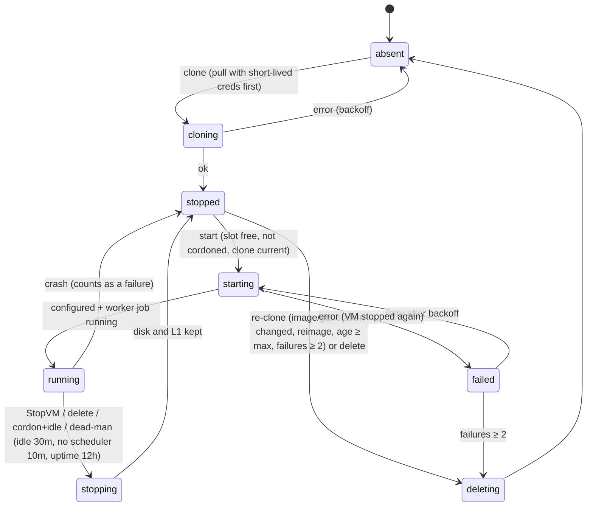

<!-- SPDX-License-Identifier: FSL-1.1-ALv2 -->

# `cucina-hostd` — macOS host agent (developer guide and contracts)

Owner: agent `hostd` (`cmd/cucina-hostd`, `internal/hostd`, `internal/hostlink`, `internal/providers/tart`).
Requirements: R-MAC-1..6, R-MAC-10, R-CACHE-2/-4, R-SEC-2/-3, R-POOL-6/-7, R-DATA-5, R-OBS-1/-4, NFR-M2, UC19..UC21.

Sections 1–3 are **published contracts** (v1.2, 2026-10-02: hostd creates the worker directories planned by
`internal/bbconfig`; `bb_worker` runs as `image.json` `workerUser`, default the build user as `workers/macos` builds it;
the L2 hop is TLS) that other agents build against:
§1 for `macimage` (the golden VM image, `workers/macos/**`), §2 and §3 for `pkg` (`macos/**`, profiles, MDM guide).
Changing them needs a note to the lead and to the consuming agent. Additive changes are preferred.

---

## 1. In-VM contract (golden image ↔ hostd)

Hostd configures every VM **at every boot** through the Tart Guest Agent (`tart exec`). Nothing secret is baked
into the image; the worker key, certificate and rendered Buildbarn configs are pushed fresh at each start and the
Buildbarn services are **started by hostd**, never automatically at boot.

### 1.1 What the image must provide

| Item | Path / value | Owner:group, mode | Notes |
| --- | --- | --- | --- |
| Image manifest | `/usr/local/cucina/image.json` | root:wheel 0644 | Schema below. Hostd refuses a VM whose manifest is missing or has `schema != 1`. |
| `bb_worker` | `/usr/local/cucina/bin/bb_worker` | root:wheel 0755 | Buildbarn darwin/arm64 release `20260930T173749Z-1a3be95`, SHA-256 verified. |
| `bb_runner` | `/usr/local/cucina/bin/bb_runner` | root:wheel 0755 | Same release. |
| Worker LaunchDaemon plist | `/usr/local/cucina/launchd/ai.sloper.cucina.bb-worker.plist` | root:wheel 0644 | **Not** in `/Library/LaunchDaemons` (must not start at boot). Content in §1.3. |
| Runner LaunchAgent plist | `/usr/local/cucina/launchd/ai.sloper.cucina.bb-runner.plist` | root:wheel 0644 | **Not** in `/Library/LaunchAgents`. Content in §1.3. |
| Config root | `/etc/cucina/`, `/etc/cucina/bb/` | root:wheel 0755 | Hostd writes `bb/worker.json`, `bb/runner.json`, `vm.json` here. |
| PKI dir | `/etc/cucina/pki/` | *worker user* 0700 | Hostd writes `worker.key` (0600), `worker.crt`, `ca.crt` (0644), owned by the worker user. `ca.crt` = Cucina CA bundle + the host's L2 CA. |
| Worker state | `/var/db/cucina/` | *worker user* 0700 | Created by hostd (bbconfig `StateRoot`): the persistent **L1** (`vm-disk` placement, default 40 GiB, survives VM shutdown, R-CACHE-2) and the file pool. |
| Runner socket dir | `/var/run/cucina/` | *build user* 0700 | Created by hostd at every boot; `bb_runner` creates `runner.sock` here. |
| Log dir | `/var/log/cucina/` | *build user*:staff 0755 | `bb_worker.log`, `bb_runner.log`; rotate with `/etc/newsyslog.d/cucina.conf` (e.g. 50 MiB × 3, `J` compression). |
| Data volume | APFS volume **`cucina`**, format **Case-sensitive APFS**, mounted at `/Volumes/cucina` | root:wheel 0755 | Same APFS container as the system volume (grows with `tart set --disk-size` + guest-agent disk resize); add `.metadata_never_index`. Hostd creates `build/` (NFSv4 mount point or native build directory) and `cache/` (native input cache) inside with the owners (worker user / build user) and modes `internal/bbconfig` plans. R-MAC-4 (case-sensitive build directories). |
| Tart Guest Agent | `tart exec` works once the VM is up | — | Cirrus Labs images ship it. See "root access" below. |
| Auto-login | the **build user** is auto-logged-in to a GUI (Aqua) session | — | `bb_runner` runs in that session (some Xcode tools need it). |
| Spotlight | off for all volumes (`mdutil -a -i off`) | — | Hostd re-asserts it at every boot (cheap); the image should still do it. |
| Xcode | exactly one Xcode, selected with `xcode-select -s`, licence accepted, first launch done (`xcodebuild -runFirstLaunch`) | — | R-MAC-7. |
| No sleep / screensaver / auto-update | as in the Cirrus templates | — | Software Update downloads must be off inside the guest. |
| File limits | launchd `maxfiles` ≥ 65536 (soft) / 524288 (hard) | — | Cirrus `limit.maxfiles.plist` is fine. |

**`image.json` schema (v1)** — JSON object, unknown fields ignored by hostd:

```json
{
  "schema": 1,
  "imageVersion": "27.0-27A266a-20261002.1",
  "macos": "27.0",
  "xcode": { "version": "27.0", "build": "27A266a",
             "developerDir": "/Applications/Xcode.app/Contents/Developer", "xcodeVersionOverride": "27.0.0.27A266a" },
  "buildbarn": "20260930T173749Z-1a3be95",
  "buildUser": "builder",
  "workerUser": "builder"
}
```

* `buildUser` (required, not root): the auto-login user that runs `bb_runner` (GUI LaunchAgent) and therefore every
  action (R-SEC-5).
* `workerUser` (optional, default `buildUser`): the worker plist's `UserName`. Native build directories work with the
  build user (the `workers/macos` default, ADR 0350); NFSv4 virtual build directories need mounts, so such an image sets
  `"root"` and drops `UserName`. Hostd owns the PKI directory and the worker-state directories accordingly.
* `xcode.developerDir` (optional, default `/Applications/Xcode.app/Contents/Developer`) and `xcode.xcodeVersionOverride`
  (Bazel's `XCODE_VERSION_OVERRIDE` value) map to `bb_runner`'s developer-directory table.
* `imageVersion` (required) is reported to the controller (VM inventory, generation checks). `xcode.version` must match
  the pool's `xcode-version` property.

**Root access for hostd.** Hostd runs every privileged guest command as `tart exec <vm> /usr/bin/sudo -n -- <cmd>`.
Two image setups satisfy this; hostd supports both and never needs a password:

* (A) *Default, simplest*: the Cirrus default — build user `admin`, passwordless sudo, Guest Agent RPC in the `admin`
  GUI session (`tart-guest-agent --run-agent`). Residual risk: an action can become root inside its VM. Accepted for v1
  because a pool is the trust boundary (R-SEC-5), the VM holds only a ≤ 12 h worker certificate and is re-cloned
  regularly (max age 7 d).
* (B) *Hardened (SHOULD)*: a dedicated **standard** build user (no sudo) with auto-login; the Guest Agent RPC moves to a
  root LaunchDaemon (`tart-guest-agent --run-daemon --run-rpc`) and the GUI agent keeps only `--run-vdagent`.
  `sudo -n` then runs as root without a sudoers entry.

### 1.2 What hostd does at every VM start (exact sequence)

1. `tart run <vm> --no-graphics --root-disk-opts=caching=cached,sync=none` (as the host's `cucina` user; never `--dir`).
2. `tart ip <vm> --wait <n>`; then poll `tart exec <vm> /usr/bin/true` with backoff until the Guest Agent answers
   (bounded by the pool's `startupTimeout`, macOS default 5 min).
3. Read facts: `tart exec <vm> /bin/cat /usr/local/cucina/image.json` and
   `tart exec <vm> /usr/bin/stat -f '%Su %u %g' /dev/console` (waits until the console owner is `buildUser`, i.e. the
   auto-login GUI session exists); when `workerUser` is neither the console user nor `root`,
   `tart exec <vm> /usr/bin/id <workerUser>`.
4. On the host: generate the VM key (ECDSA P-256), CSR → `HostService.IssueVMIdentity` → certificate + CA +
   `WorkerSettings`. Hostd **overwrites** `storage_endpoint` with its L2 relay and `scheduler_endpoint` with its
   scheduler relay (both on the vmnet gateway address, §1.4), then renders `bb_worker`/`bb_runner` JSON with
   `internal/bbconfig` using the machine facts in §1.5.
5. Push files over **stdin** (never argv — argv is visible to every host user):
   `tart exec -i <vm> /usr/bin/sudo -n -- /usr/bin/tar -x -p -f - -C /private/etc/cucina`
   The tar stream contains `bb/worker.json`, `bb/runner.json`, `vm.json` (root, 0644) and `pki/worker.key` (0600),
   `pki/worker.crt`, `pki/ca.crt` (0644) owned by the worker user. Existing files are replaced.
6. Activate (one `tart exec <vm> /usr/bin/sudo -n -- /bin/sh -c '<script>'`, script generated by hostd):
   ```sh
   set -eu
   mdutil -a -i off >/dev/null 2>&1 || true
   install -d -o <uid> -g <gid> -m 0755 /var/log/cucina
   # every directory of bbconfig's WorkerPlan.Directories (worker user or build user), e.g.:
   mkdir -p '/var/db/cucina' && chown <wuid>:<wgid> '/var/db/cucina' && chmod 700 '/var/db/cucina'
   mkdir -p '/var/run/cucina' && chown <uid>:<gid> '/var/run/cucina' && chmod 700 '/var/run/cucina'
   launchctl bootout gui/<uid>/ai.sloper.cucina.bb-runner 2>/dev/null || true
   launchctl bootout system/ai.sloper.cucina.bb-worker 2>/dev/null || true
   # (bounded retry loop around each bootstrap: bootout completes asynchronously)
   launchctl bootstrap gui/<uid> /usr/local/cucina/launchd/ai.sloper.cucina.bb-runner.plist
   launchctl bootstrap system /usr/local/cucina/launchd/ai.sloper.cucina.bb-worker.plist
   ```
7. Health: `launchctl print system/ai.sloper.cucina.bb-worker` shows `state = running`, `bb_worker`'s metrics endpoint
   (`http://<vm-ip>:<metrics_port>/metrics`, scraped by hostd as root) answers, and the controller sees the worker
   `{pool, node=<host>/<vm>}` register through the relay. Hostd then reports `VMEvent{event: "ready"}`.

Stop: the controller drains first (`AddDrain`), then hostd runs `tart stop <vm> --timeout <t>`; macOS shuts down and
launchd sends SIGTERM to `bb_worker`/`bb_runner`. Disk and L1 are kept. Nothing is cleaned in the guest at stop: the
next start pushes fresh credentials and re-bootstraps the services.

### 1.3 launchd plists the image installs (exact keys)

`ai.sloper.cucina.bb-worker.plist` (bootstrapped into the **system** domain = LaunchDaemon semantics; it needs the network):

| Key | Value |
| --- | --- |
| `Label` | `ai.sloper.cucina.bb-worker` |
| `UserName` / `GroupName` | `workerUser` (absent when it is `root`) / `staff` |
| `ProgramArguments` | `/usr/local/cucina/bin/bb_worker`, `/etc/cucina/bb/worker.json` |
| `RunAtLoad`, `KeepAlive` | `true`, `true` (applies only after hostd bootstraps it) |
| `ThrottleInterval` | `5` |
| `ProcessType` | `Interactive` (no launchd resource throttling for build work) |
| `SoftResourceLimits` / `HardResourceLimits` `NumberOfFiles` | `65536` / `524288` |
| `StandardOutPath`, `StandardErrorPath` | `/var/log/cucina/bb_worker.log` |

`ai.sloper.cucina.bb-runner.plist` (bootstrapped into **`gui/<uid>`** of the build user = LaunchAgent in the auto-login session):

| Key | Value |
| --- | --- |
| `Label` | `ai.sloper.cucina.bb-runner` |
| `LimitLoadToSessionType` | `Aqua` |
| `ProgramArguments` | `/usr/local/cucina/bin/bb_runner`, `/etc/cucina/bb/runner.json` |
| `RunAtLoad`, `KeepAlive`, `ThrottleInterval`, `ProcessType`, limits | as above |
| `StandardOutPath`, `StandardErrorPath` | `/var/log/cucina/bb_runner.log` |

One `bb_runner` process serves every runner platform of the VM (Xcode + generic arm64): both `bb_worker` runner entries
point at the same socket in `/var/run/cucina/`. If `internal/bbconfig` ever needs one process per runner, the
labels become `ai.sloper.cucina.bb-runner.<runner>` with configs `/etc/cucina/bb/runner-<runner>.json` (additive).

### 1.4 Networking (VMs talk only to their host)

* Tart's default **shared (NAT) vmnet** network. The host is the vmnet gateway (default `192.168.64.1`; hostd learns
  the address from the host's bridge interface on the VM's subnet, never hard-codes it).
* Hostd listens on the gateway side and **relays** (L4 pass-through, per-VM connection limits, admission only from the
  IPs of VMs hostd itself started, arriving on the bridge interface — ADR 0700):

  | VM dials | Hostd relays to | Protocol |
  | --- | --- | --- |
  | `<gateway>:8981` (`storage_endpoint`) | host L2 `bb_storage` on `127.0.0.1:8991` | TLS end-to-end: the L2 presents a certificate from a **host-local L2 CA** (hostd adds it to the VM's `ca.crt`; server name `cucina-host-l2`) and verifies the VM's worker certificate (`spiffe://cucina/worker/<pool>/<serial>/<vm>`) |
  | `<gateway>:8983` (`scheduler_endpoint`) | controller's scheduler worker endpoint (`HostSettings.scheduler_endpoint`) | **TLS end-to-end** from the VM: the VM presents its own short-lived certificate (`spiffe://cucina/worker/<pool>/<host>/<vm>`) and verifies the scheduler with `server_name` |

* The image must not depend on any other outbound access (DNS to the internet is not needed for builds). Hostd makes
  every connection to a VM IP itself (as root), never from the `tart` child (Local Network privacy, R-MAC-10).

### 1.5 Machine facts hostd passes to the renderer for a Tart VM

`bbconfig.Machine{OS: darwin, Arch: arm64, VCPUs, MemoryBytes}` = what hostd gave the VM (§4 sizing),
`StateRoot=/var/db/cucina`, `BuildRoot=/Volumes/cucina`, `RunDir=/var/run/cucina`, `PKIDir=/etc/cucina/pki`,
`CABundlePEM` = Cucina CA + host L2 CA, `StorageServerName=cucina-host-l2`, `StorageIsHostL2=true`,
`BuildUser` = the console user's uid/gid, L1 placement `vm-disk` (persistent, default 40 GiB, R-CACHE-2);
storage endpoint `<gateway>:8981`, scheduler endpoint `<gateway>:8983` (both TLS).

### 1.6 Dead-man switch for VMs (R-POOL-7)

Enforced by **hostd from outside the VM** (it works when the controller is gone): idle beyond `idle_limit` (default
30 min, from `bb_worker`'s metrics), no scheduler reachability through the relay for `unreachable_limit` (10 min), or
uptime beyond `max_uptime` (12 h) → `tart stop`. The image does not need an in-VM dead-man agent.

---

## 2. Host contract (pkg ↔ hostd)

| Item | Value |
| --- | --- |
| pkg identifier | `ai.sloper.cucina.host` |
| LaunchDaemon label / plist | `ai.sloper.cucina.hostd` / `/Library/LaunchDaemons/ai.sloper.cucina.hostd.plist` (root:wheel 0644) |
| Program | `/usr/local/cucina/bin/cucina-hostd run` |
| plist keys | `RunAtLoad` true, `KeepAlive` true (crash-only), `AbandonProcessGroup` true (running VMs survive a hostd restart or upgrade and are re-adopted; hostd also starts `tart run` in its own session), `ThrottleInterval` 10, `ProcessType` `Standard`, `NumberOfFiles` 65536/65536, `StandardOutPath`/`StandardErrorPath` `/Library/Logs/Cucina/hostd.stderr.log` (panics only; hostd logs JSON itself) |
| Host L2 binary | `/usr/local/cucina/bin/bb_storage` (bb-storage `20260930T153215Z-086b011`, darwin/arm64), supervised by hostd — **no** separate launchd job |
| Tart | `/usr/local/cucina/tart.app` (official release, never re-signed); hostd runs `/usr/local/cucina/tart.app/Contents/MacOS/tart` (override: `TartPath`) |
| VM user | `cucina` — standard (non-admin) user, auto-login, FileVault off; owns `~cucina/.tart` (Tart's default `TART_HOME`). Hostd fails fast if it does not exist (root mode). |
| State dir | `/var/db/cucina/hostd/` (root:wheel 0700): identity certificate, enrollment state, VM inventory journal |
| L2 cache dir | `/var/db/cucina/l2/` (root:wheel 0700), default 200 GiB (`L2SizeGiB`) |
| Keys | System keychain (`/Library/Keychains/System.keychain`), generic-password items, service `ai.sloper.cucina.hostd`, accounts `host-identity-key` (host mTLS key) and `host-l2-ca-key` (host-local CA for the L2's VM-facing certificate), PKCS#8 DER. Preserved across upgrades; removed only by uninstall `--purge`. |
| Logs | `/Library/Logs/Cucina/hostd.log` (JSON, rotated by hostd 5 × 20 MiB), `/Library/Logs/Cucina/bb_storage.log` (rotated by hostd); unified logging subsystem `ai.sloper.cucina`, category `hostd` (`log show --predicate 'subsystem == "ai.sloper.cucina"'`) |
| Listeners | `0.0.0.0:8981` and `0.0.0.0:8983` (VM relays, admission by VM IP on the vmnet bridge); `127.0.0.1:9470` hostd `/metrics` (override `MetricsListen`); `127.0.0.1:8991` / `127.0.0.1:9991` L2 gRPC / diagnostics |
| Application firewall | with `EnableFirewall`, add `/usr/local/cucina/bin/cucina-hostd` as allowed (`socketfilterfw --add … --unblockapp …`) so VMs can reach the relays; bb_storage listens on loopback only |
| vmnet DHCP lease | 600 s: `/Library/Preferences/SystemConfiguration/com.apple.InternetSharing.default.plist` `bootpd.DHCPLeaseTimeSecs = 600` (hostd re-asserts at start in root mode; postinstall may set it too) |
| Upgrade in place | stop daemon (`launchctl bootout system/ai.sloper.cucina.hostd`), replace binaries, bootstrap again; never touch `/var/db/cucina`, the keychain item or `~cucina/.tart` |
| Uninstall | bootout, remove `/usr/local/cucina`, the plist, `/Library/Logs/Cucina`; `--purge` additionally removes `/var/db/cucina`, the keychain item and (optionally) VMs/images |

Hostd exit codes (launchd restarts it; a config error is logged once per start with the precise key):
`0` clean stop, `2` invalid configuration, `3` enrollment refused (`DENIED`/`TOKEN_INVALID`), `1` other.

## 3. Configuration (managed preferences, R-MAC-10)

Preference domain **`ai.sloper.cucina.hostd`** (MDM custom-settings payload →
`/Library/Managed Preferences/ai.sloper.cucina.hostd.plist`). Hostd (root) reads each key with
`CFPreferencesCopyAppValue` and records `CFPreferencesAppValueIsForced`; managed (forced) values take precedence over
locally written preferences, as CFPreferences resolves them. When CF is unavailable (user mode, tests) hostd parses the
plist file directly. Validation is strict: an unknown key, a wrong type or an out-of-range value exits with code 2 and a
message naming the key. The Go type is `internal/hostd/config.Config`.

| Key | Type | Required | Default | Meaning |
| --- | --- | --- | --- | --- |
| `ControllerURL` | string | yes | — | Enrollment endpoint, `https://host:port` (EnrollmentService). The mTLS HostService address is returned by enrollment. |
| `ControllerServerName` | string | no | host of `ControllerURL` | TLS server name to verify. |
| `CACertificate` | string (PEM) or data (PEM/DER) | one of these two | — | Cucina CA bundle used to verify the controller. |
| `CAPinSHA256` | string or array of strings | one of these two | — | Lowercase hex SHA-256 of the DER SubjectPublicKeyInfo of a certificate in the controller's chain. |
| `SiteEnrollmentToken` | string | yes, until enrolled | — | Multi-use site token (R-SEC-3). Sent **once**; never logged; ignored after enrollment. |
| `IdentityLabel` | string | no | — | Label of an MDM-issued identity (ACME/SCEP) in the System keychain; when present, used instead of token enrollment (stronger path). |
| `Site` | string | no | `""` | Site name (L2 site tier, image mirror). |
| `Labels` | dictionary (string → string) | no | `{}` | Host labels for pool `hostSelector`s. |
| `VMSlots` | integer 1–2 | no | `2` | Concurrent VMs (Apple limit 2). |
| `VMCPUCount` | integer ≥ 0 | no | `0` = (cores − 2) / slots | vCPUs per VM. |
| `VMMemoryGiB` | integer ≥ 0 | no | `0` = (RAM − 8 GiB) / slots | Memory per VM. |
| `L2SizeGiB` | integer 10–4096 | no | `200` | Host L2 cache size. |
| `LogLevel` | string `debug`/`info`/`warn`/`error` | no | `info` | |
| `TartPath` | string (absolute) | no | `/usr/local/cucina/tart.app/Contents/MacOS/tart` | |
| `RunAsUser` | string | no | `cucina` | User that runs `tart` (R-MAC-2). |
| `VMMaxAgeHours` | integer 1–2160 | no | `168` | Re-clone VMs older than this (R-MAC-3). |
| `MetricsListen` | string `host:port` | no | `127.0.0.1:9470` | Hostd `/metrics` (empty disables it). |
| `VMNamePrefix` | string `[a-z][a-z0-9-]{1,30}-` | no | `cucina-vm-` | Tart name prefix of the VMs hostd manages (others are never touched). |

Precedence for the tunables that the controller can also set (`VMSlots`, `VMCPUCount`, `VMMemoryGiB`, `L2SizeGiB`,
`LogLevel`): non-zero `HostSettings` from the controller (`Welcome`/`UpdateHostConfig`) override the preference values
(the proto's "overrides on top of the managed preferences"); connection and identity keys can never be changed by the
controller. Hard limits always win: at most 2 running VMs, and VM sizing never exceeds the host.

User mode (`--user-mode`, development, T13) reads the same keys from `--config <file.plist>` (default
`~/.config/cucina/hostd/config.plist`), keeps its key in `~/.config/cucina/hostd/` (0700, file SecretStore), logs to
`~/Library/Logs/Cucina/`, runs `tart` as the current user and skips root-only steps (vmnet lease, System keychain).

## 4. Architecture

```
                       controller (k8s)                                       Mac mini (root LaunchDaemon)
 EnrollmentService :8445 (TLS) ◄── EnrollHost once (site token) ──── identity ── System keychain (host key)
 HostService       :8446 (mTLS) ◄══ Connect stream (outbound) ═════ link ── vmm ── lifecycle (pure core)
   internal/hostlink: sessions,      Hello/Heartbeat/VMEvent/Result     │      │
   command queue, HostFleet          Start/Stop/Delete/Reimage/Pull/…   │      └─ tart adapter ─ launchctl asuser → tart (cucina)
                                                                        ├─ relay :8981 → L2 bb_storage 127.0.0.1:8991 ─► central (WAN, zstd)
   scheduler worker endpoint ◄══════════════════════════════════════════┴─ relay :8983 (VM mTLS end to end)
```

| Package | Role |
| --- | --- |
| `cmd/cucina-hostd` | cobra CLI: `run` (`--user-mode`, paths, listeners), `check-config`, `facts`, `version`, hidden `drop-exec` trampoline. Exit codes 0/1/2 (config)/3 (enrollment refused). |
| `internal/hostd` | `Agent`: wiring, command handler, Hello/Heartbeat, housekeeping (renewal at ⅔ lifetime, idle-time pre-pull of `desired_images`, `tart prune --space-budget`), diagnostics. |
| `internal/hostd/config` | Managed-preferences schema, strict parsing (plist file or CFPreferences via cgo), controller overrides. |
| `internal/hostd/lifecycle` | Pure planner + transitions (below); `Size` formula. Property-tested. |
| `internal/hostd/vmm` | Executes plans against `ports.VMRuntime`, journal (`vms.json`), crash detection and adoption, the §1.2 start sequence, activity probes. |
| `internal/hostd/{identity,secretstore}` | Host key (keychain / 0600 file), enrollment polling, renewal, TLS configs (CA or SPKI pin). |
| `internal/hostd/{relay,l2}` | ADR 0700 relays; `bb_storage` supervision (host-local CA, restart with backoff, metrics scrape). |
| `internal/hostd/{privdrop,sys}` | ADR 0701 command construction, trampoline, production Exec/FS/Clock. |
| `internal/hostd/{facts,guest,render,metrics,logging,redact}` | Host facts; in-VM commands/bundle; `bbconfig` adapter; `/metrics`; JSON file + `os_log`; source-side redaction. |
| `internal/providers/tart` (+ `faketart`) | `ports.VMRuntime` over the tart CLI; in-process tart CLI + guest emulator for tests. |
| `internal/hostlink` (+ `hostcmd`, `hostlinktest`) | Controller side: `HostService` server, `ports.HostFleet`, diagnostics streaming; error codes; in-memory test bed. |

### 4.1 VM lifecycle (R-MAC-3, R-POOL-7)



`lifecycle.Plan(host, limits, now)` is level-triggered and deterministic; in-flight phases are never re-planned; a start
is planned only while `active + external < min(slots, 2)`. StartVM is refused (`vm-limit`) when the host already wants
`slots` VMs running, and while cordoned (`cordoned`). VM size: first non-zero of the StartVM request, the controller's
`HostSettings`, the preference, or `(cores − 2)/slots` vCPUs and `(RAM − 8 GiB)/slots` memory; memory never exceeds the
derived share.

### 4.2 Controller link

* Dial OUT to `HostService` (endpoint from enrollment; default port 8446) with the host certificate; first message
  `Hello{protocol, serial, facts, VMs, images, boot_id}` (a full resync on every connect), answered by `Welcome`
  (protocol check, heartbeat interval, slots, `HostSettings`, desired images). Heartbeats carry the VM inventory and L2/disk
  metrics. Reconnect: exponential backoff with jitter 1 s → 60 s; client keepalive 30 s/20 s (the server must allow
  pings every ≥ 10 s).
* Commands run once per `command_id` (the last 1024 ids remember their result; a duplicate gets the stored result).
  Results and events are queued across reconnects. Rejections carry a code (`internal/hostlink/hostcmd`:
  `vm-limit`, `cordoned`, `not-found`, `invalid`, `failed`) that hostlink maps to `ports` sentinels.
* hostlink re-sends unanswered commands after a reconnect with the same id, marks a host offline on disconnect or after
  `StaleAfter` (45 s) without messages (its VMs become `unavailable`), and issues VM identities only for VMs it asked that
  host to run (the serial always comes from the client certificate; a `Hello` claiming another serial is refused).
* Diagnostics: `CollectDiagnostics{vm_name, unit, tail_lines, follow}` streams one VM's `bb-worker`/`bb-runner` log or
  hostd's own (`agent`), followed for at most 10 min; everything is passed through `redact` on the host (PEM blocks,
  JWTs, `cuc_*` tokens, GitHub/AWS credentials, password assignments, the configured site token).

### 4.3 Metrics and logs

`/metrics` (default `127.0.0.1:9470`): `cucina_hostd_vms{state}`, `cucina_hostd_l2_requests_total{result}`,
`cucina_hostd_wan_bytes_total{direction}`, `cucina_hostd_l2_size_bytes`, `cucina_hostd_disk_free_bytes`,
`cucina_hostd_controller_connected`, `cucina_hostd_relay_bytes_total{relay,direction}`, Go/process collectors (RSS,
NFR-M2 ≤ 100 MiB). The same L2/disk numbers ride on every heartbeat (Mac sites are behind NAT). Logs: JSON lines to
`hostd.log` (5 × 20 MiB) and unified logging (`log show --predicate 'subsystem == "ai.sloper.cucina"'`).

### 4.4 Running hostd in user mode against a dev controller (T13)

1. Build: `CGO_ENABLED=1 go build -o "$CUCINA_DEV_STORAGE/hostd-bin/cucina-hostd" ./cmd/cucina-hostd` (Go ≥ 1.23.3
   emits `LC_UUID`, needed for Local Network privacy).
2. Write `~/.config/cucina/hostd/config.plist` (0600; same keys as §3): `ControllerURL` (the dev controller's enrollment
   endpoint), `CACertificate` (its CA bundle), `SiteEnrollmentToken` (a site enrollment token created with `cucinactl`), optionally
   `VMSlots`, `VMNamePrefix` (e.g. `cucina-t13-` to keep the VMs apart from other local VMs). Check it:
   `cucina-hostd check-config --user-mode`.
3. Pre-approve the dev Mac (`cucinactl hosts register <serial>`; `cucina-hostd facts` prints everything but the serial,
   `ioreg -rd1 -c IOPlatformExpertDevice | grep IOPlatformSerialNumber` shows it).
4. Run in the foreground: `cucina-hostd run --user-mode --bb-storage "$CUCINA_DEV_STORAGE/bb-release/20260930T153215Z-086b011/bb_storage.darwin_arm64" --l2-cache-dir "$CUCINA_DEV_STORAGE/hostd-l2"`
   (state and keys stay in `~/.config/cucina/hostd/`, logs in `~/Library/Logs/Cucina/`, VMs in your `TART_HOME`).
   Nothing is installed system-wide; stop with Ctrl-C (VMs keep running and are adopted at the next start).
5. The controller's `MacHost` shows the host Online; scale a Tart pool to start VMs.

### 4.5 Tests

| Tier | What | Command |
| --- | --- | --- |
| unit | lifecycle property test (2-VM cap, cordon, re-clone, dead-man), re-clone/dead-man/sizing tables, managed preferences (XML/binary, forced vs local, strict errors), privilege-drop construction, redaction, L2 metric parsing, tart JSON/error mapping | `go test ./internal/hostd/... ./internal/providers/tart/...` |
| integration | hostd ↔ hostlink over in-memory mTLS with the tart emulator inside `testing/synctest` (enrollment pending→approved, StartVM→configured VM, 2-VM cap, persistence, crash, disk full, reset_peer/timeout/down, controller restart resync, hostd restart adoption, idempotency, refused token, log streaming); `porttest.RunVMRuntime` on the adapter + emulator; `porttest.RunHostFleet` on hostlink + hostd; relay on localhost | `go test ./internal/hostlink/... ./internal/hostd/relay/` |
| acceptance | `porttest.RunVMRuntime` against real Tart with throwaway `cucina-test-*` VMs | `CUCINA_TART_ACCEPTANCE=1 CUCINA_TART_IMAGE=<local image> go test -run TestConformanceRealTart ./internal/providers/tart/` |
| manual | MT-001 (root daemon → `cucina` Tart path, both privdrop modes), MT-004 (power/network/disk faults) | `docs/testing/manual/` |
