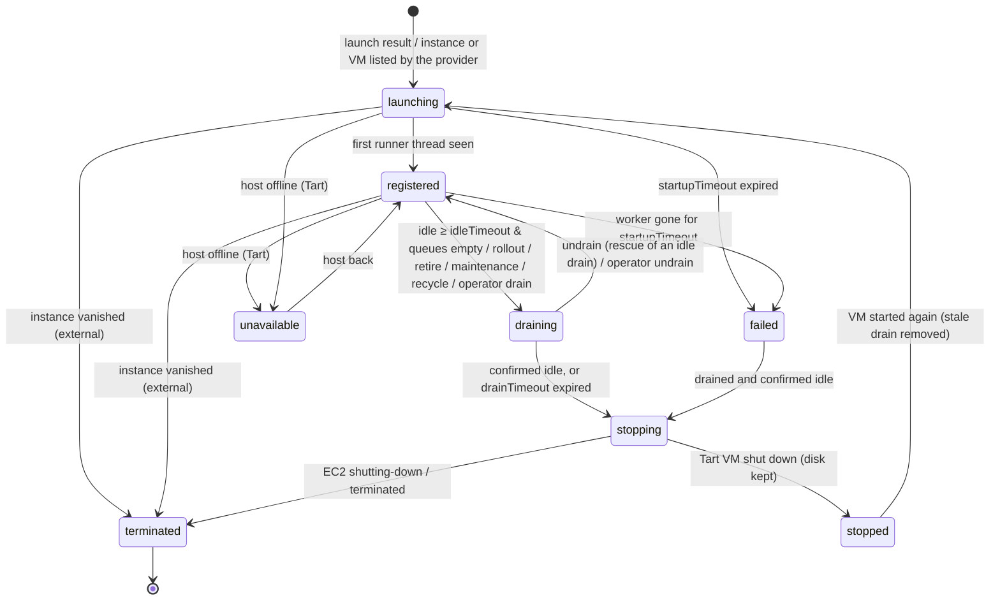

<!-- SPDX-License-Identifier: FSL-1.1-ALv2 -->
# Autoscaler core, fakes, conformance suites and simulation

The autoscaler is a pure, deterministic core (`internal/scaling`, R-SCALE-1..8, R-TEST-8c, ADR 0500). It does no I/O, starts no
goroutines, never reads the wall clock and draws randomness only from an injected `ports.Rand`. The reconciler (`internal/reconcile`)
observes, calls `Plan`, executes the returned actions and feeds their results back into the next observation. The same core runs in the
deterministic simulation (`sim/`) against the stateful fakes (`internal/fakes`); the invariants (`invariants/`) are checked by the planner
on its own actions, by the executor, and by the simulation against ground truth after every step.

## Driving it (executor contract)

```go
planner := scaling.NewPlanner(scaling.Config{ /* from config.Autoscaler + config.Scheduler */ }, rnd)
st := scaling.NewPoolState(pool, persistedLedger) // once per pool per leader term; zero Ledger for a new pool
if err := scaling.ValidateSpec(spec, cfg); err != nil { /* condition + no autoscaling (fail fast, R-TEST-7) */ }

for each poll (1–2 s) {
    obs := scaling.Observation{
        Now: clock.Now(),
        Queues: <ListPlatformQueues filtered to the pool's queues>, QueuesKnown: err == nil,
        QueuedShare: <AttributeShared(...) when several pools serve one queue, else nil>,
        Workers: <ListWorkers on the pool's queues, threads with pool=<pool>>, WorkersKnown: err == nil,
        Drains: <ListDrains on the pool's queues>,
        Instances: <Compute.Describe{Cluster, Pool, States: pending,running,shutting-down,terminated,stopping,stopped}>  // EC2
        Hosts: <HostFleet.Hosts()>, TartFreeSlots: <placement helper>,                                                   // Tart
        ProviderKnown: err == nil,
        ImageErr: <image resolution error or nil>,
        LaunchBudget: bucket.Budget(now),            // shared RunInstances token bucket (scaling.TokenBucket), EC2 only
        InstanceSecondsToday: <cost accounting>,     // only needed with a daily instance-hour cap
        Results: <one Result per Action of the previous decision>,
    }
    d := planner.Plan(spec, obs, st)
    if d.LedgerChanged { persist(d.Ledger) }  // write-ahead: BEFORE any launch of d; on failure skip the launches (ErrSkipped)
    results = execute(d.Actions)              // in order; batch terminates/drains; ErrSkipped for anything not run
    report(d.Violations); export(d.Desired, d.VMs, d.Status)
}
```

Rules for the executor:

* **Every action gets exactly one `Result`** in the next observation (`ErrSkipped` if not executed, e.g. no API budget or lost lease).
  A launch without a result stays in flight and counts as pending capacity.
* **Launch (EC2)**: `Compute.Launch` with `Token = a.Launch.Token`, tag `cucina:launch-token = Token`, `InstanceTypes`/`SubnetIDs` from
  the intent (type and subnet rotation already applied), `Generation = a.Launch.Generation`; put the returned instance into `Result.Instance`. Never
  invent a token; re-check `invariants.LaunchWithinMax` right before the call.
* **Launch (Tart)**: pick a host with the placement helper (one VM per host before a second, prefer restarting a stopped VM of the pool:
  warm L1), call `HostFleet.StartVM`, put `"<host>/<vm>"` into `Result.VM`.
* **drain / undrain / remove-drain**: `AddDrain`/`RemoveDrain` on every queue of the pool with pattern `{pool: <pool>, node: <node>}`.
  Operator drains (management API, UC14, ADR 0582) use `{node: <node>}`; the planner never removes them (ADR 0503).
* **terminate** (EC2, batched) / **stop** (Tart, `tart stop --timeout`); per-node failures go into `Result.PerVM`.
* **fail-queues**: `KillOperations{QueueWithoutWorkers: &q}` per queue with `a.Code` (`FAILED_PRECONDITION`) and `a.Message`.
* Metrics: `cucina_scale_decisions_total{pool, action=a.Kind}` per executed action; `cucina_vm_stops_total{pool, reason=a.Reason}` per
  terminated/stopped node; `cucina_pool_desired = d.Desired`; `cucina_pool_vms{state}` from `d.VMs`.
* Conditions: `QueueDeclared`, `ImageResolved`, `CapacityAvailable` from `d.Status`; `Degraded` when `d.Status.CapacityFailure != ""`;
  `d.Status.Empty` with `Spec.Deleting` tells the finalizer that no VM is left.
* Shadow mode (R-TEST-7): `clone := st.Clone()` before `Plan`, then `candidate.Plan(spec, obs, clone)` and `scaling.DiffDecisions`.

## Policy

With `D_r = queued_r + executing_r` over the queues of runner `r`, `N = Spec.VCPUs` (default: largest runner concurrency) and `S_r` the
runner's slots per VM: `desired = clamp(max(ceil(Σ_r D_r / N), max_r ceil(D_r / S_r)), minRunning', max)`,
`minRunning' = max(spec.minRunning, active floor windows)` (0 while paused or deleting).

* `executing_r` counts the pool's own executing threads; `queued_r` is the queue's count, or the pool's share (`QueuedShare`) for
  queues served by several pools (`AttributeShared`: lexical pool order, eligible pools first, up to their thread headroom).
* **Scale-out** reacts to the first queued action at once. Capacity = registered-and-not-draining + launching VMs + launches in flight +
  ledger ghosts. A VM draining for idleness is **rescued** (`undrain`) before any new launch.
* **Scale-in** only through per-VM idle timers: a VM idle at every poll for `idleTimeout` while all pool queues were empty is drained,
  confirmed idle in the worker list, then terminated (EC2; drain removed once it is gone) or stopped (Tart; drain removed when it next
  starts), never below `minRunning'`. Any queued work, and any poll without scheduler data, restarts the timers (ADR 0503).
* **Never stop a busy VM** unless its drain timeout expired. Every stop — idle, rollout, retire, maintenance, recycle, failed — goes
  through a drain confirmed idle; the planner re-checks each stop against `invariants.StopAllowed` and drops violators.
* **Startup**: a VM not registered within `startupTimeout` (or whose worker vanished that long) is `failed`, drained, stopped and
  replaced; while failures continue only one probe VM starts at a time (ADR 0502).
* **Capacity errors** (ICE, quota, missing image, startup failures): equal-jitter exponential backoff (`BackoffMin..BackoffMax`, once
  per decision); instance types and subnets tried before the one that succeeded move to the end of their lists for
  `CapacityCooldown` (rotation); throttling uses the
  shorter throttle backoff and keeps the token. With work waiting, no registered VM and a capacity problem for `QueueFailAfter`, the
  queued work is failed (`fail-queues`, `no-capacity`, R-RE-2).
* **Fail fast** immediately (queues without workers): `max = 0`, paused, deleting, image missing, queue not declared, daily cap reached.
* **Rollout** (R-OPS-2): launches use `spec.Generation`. `lazy` (EC2): an old-generation VM is drained at its first idle poll with empty
  queues; Tart VMs are re-cloned by hostd at their next start. `eager`: every old-generation VM is drained at once.
* **Dead-man consistency** (R-POOL-7): `ValidateSpec` rejects `idleTimeout + margin ≥ Deadman.IdleLimit` and recycle margins shorter
  than `drainTimeout`; VMs within `RecycleMargin` of `Deadman.MaxUptime` are drained in advance (`deadman`).
* **API hygiene** (R-SCALE-6): launches per decision ≤ `LaunchBudget`; terminates are batched.

## VM state machine



## Restarts and idempotency (R-SCALE-5, ADR 0501)

* Launch tokens are `cuc-<hash(cluster,pool)>-<epoch>-<seq>` from the pool's ledger `{Epoch, Committed, Next, At}`, persisted write-ahead.
  A seq is committed only when its outcome is known **and** its instance was listed by `Describe` (or `ConsistencyGrace` passed); every
  launch attempt (fresh, reused or retried token) refreshes `At`.
* A restarted leader reuses the unlisted seqs of `[Committed, Next)` first (EC2 deduplicates the token) and counts them as pending
  capacity until reused or `At + ConsistencyGrace`; it launches nothing and commits nothing before its first provider listing.
* Capacity rests on provider listings and launch results only — never on worker threads of nodes the provider does not list yet.
* Soft state is rebuilt conservatively: idle timers restart at the first observation, `{pool,node}` drains are adopted (a drain older
  than a Tart VM's current run is removed), `shutting-down` instances are `stopping`.

## Reason codes

| Kind | Values |
| --- | --- |
| `cucina_scale_decisions_total{action}` | `launch`, `drain`, `undrain`, `remove-drain`, `terminate`, `stop`, `fail-queues` |
| `cucina_vm_stops_total{reason}` | `idle`, `drain`, `rollout`, `startup-timeout`, `deadman`, `maintenance` (contracts §6) + `retire`, `external` |
| holds / conditions | `max-zero`, `paused`, `deleting`, `image-missing`, `queue-not-declared`, `no-capacity`, `capacity`, `startup-failures`, `launch-error`, `throttled`, `daily-cap`, `api-budget`, `at-max`, `no-host-slots`, `observation-incomplete` |

## Fakes and conformance suites (R-TEST-8a/b)

`internal/fakes` has one stateful fake per port: `Clock` (manual; `SystemClock` inside `testing/synctest`), `Rand` (seeded PCG, `Child`
streams), `Compute` (pending→running→ready latency, eventually consistent `Describe`, per-(type, AZ) capacity, vCPU quota, token buckets,
idempotent tokens incl. terminated instances, orphan leaks, Fast Launch, prices, `OnReady`/`OnTerminated` hooks, `Interrupt`), `BuildQueue`
(predeclared queues, threads registered from hooks, FIFO dispatch, drains, `KillOperations`, restarts), `VMRuntime` (one host's tart: 2-VM
cap, disk budget, guest-agent flakiness), `HostFleet` (hosts, cordons, offline/reboot, re-clone on generation), `IdentityProvider`
(EdDSA tokens for any issuer, Google/GitHub claim shapes, key rotation), `SecretStore`, `Exec`, `FS`. All expose `FailNext`, `FailRate`,
`SetLatency` and ground-truth accessors for oracles.

`internal/ports/porttest` holds `RunCompute`, `RunBuildQueue`, `RunVMRuntime`, `RunHostFleet`, `RunClock`, `RunFS`, `RunSecretStore`.
They run against the fakes in `internal/fakes/conformance_test.go`; an adapter runs them in acceptance with its own harness (capabilities
the backend can't provide, such as `ForceICE`/`ForceThrottle`, are nil and the checks skip). When a real adapter fails, fix the fake.

## Simulation (`sim/`, R-TEST-8c)

* Scenarios: `sim/scenarios/*.yaml` (`fleet`, `workload` — inline arrivals, Poisson generators or a JSONL trace —, `faults`, `seed`,
  `expectations`), strict YAML. Fault kinds: `ice`, `quota`, `throttle`, `api-error`, `controller-restart` (`midScale`),
  `worker-death`, `spot-interruption`, `network-cut`, `scheduler-restart`, `host-offline`, `host-reboot`, `image-missing`,
  `start-failure`, `leak`, and the operator events `rollout` and `delete`.
* Every step: faults, arrivals, fake clocks, observe → `Plan` → persist ledger → execute (exactly like the reconciler), then the
  invariants against ground truth (max, busy terminations, idle scale-in, tags, tokens, stopped instances, 2 VMs/host, orphans).
* Run: `go run ./sim/cmd/simctl run -scenario sim/scenarios/burst.yaml -log 100` (add `-seed N -chaos` to reproduce a sweep seed).
* Sweep: `go test ./sim -run TestSweep -sweep.seeds=1000` (random fault schedule per seed; add `-sweep.write` to minimise failing seeds
  into `sim/scenarios/regressions/`, red-first: they must pass once fixed). Bazel: the `simulation` tier target.
* Replay: `simctl replay -scenario sim/scenarios/replay-workday.yaml -policy default -policy idle2m:idle=2m` prints cost vs queue wait
  per policy (keys: `idle`, `startup`, `drain`, `queueFailAfter`, `backoffMin`, `backoffMax`, `cooldown`, `grace`).
* Shadow: `simctl shadow -scenario … -policy default -candidate idle2m:idle=2m` counts the decisions a candidate would change.

## Mutation testing (R-TEST-5.6)

`gremlins unleash ./internal/scaling` (v0.6.0) runs the package's own unit and property tests per mutant. Baseline 2026-10-02:
533 mutants, 191 killed, 4 timed out, 228 lived, 110 not covered (efficacy 45.6 %, mutator coverage 79.2 %). The property tests assert the R-TEST-6 safety invariants
(max, busy terminations, idle scale-in, flapping, desired ≥ 1, scale to zero) on a one-runner EC2 world with Describe lag, faults and
restarts. Survivors, by reason (annotate new ones the same way or kill them):

* **Constants/defaults** (`DefaultConfig`, `withDefaults`): values, not behaviour (R-TEST-4).
* **Explanatory outputs** (`status`, `Demand`, `ThreadHeadroom`, hold reasons): asserted by `internal/reconcile` condition tests.
* **Paths outside the unit world** (rollout, recycle, operator drains, Tart hosts, paused/deleting, daily cap, shared queues): covered
  by `sim/` scenarios and the sweep, which check the same invariants against ground truth but are not part of a gremlins run.
* **Latency-only boundaries** (backoff loop bounds, cooldown/grace `<`/`<=`, ghost windows): change how soon, never whether, a safe
  action happens.
